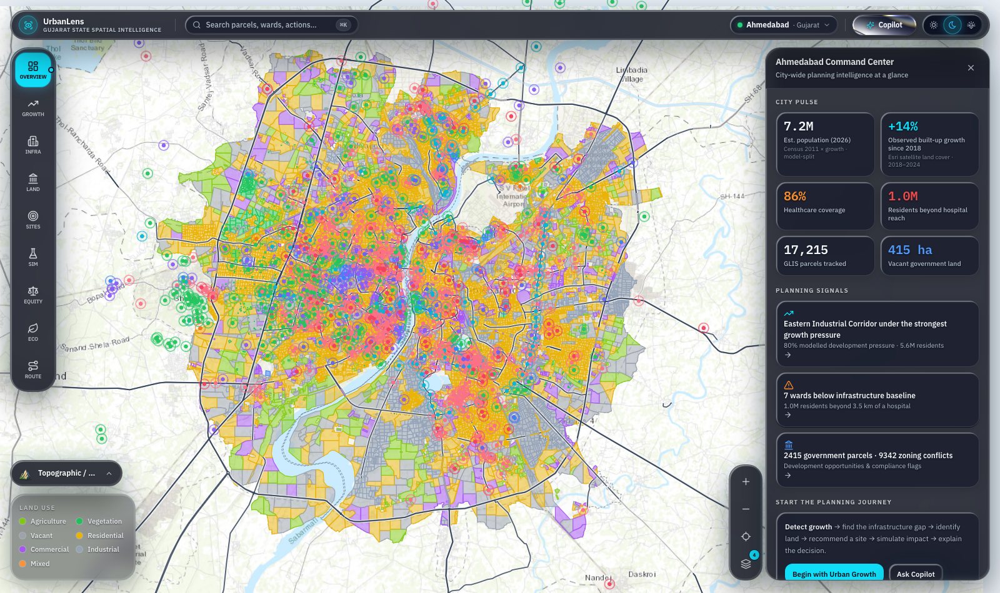
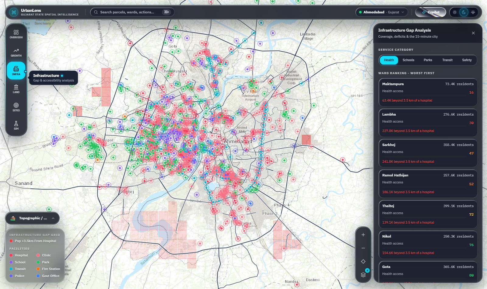
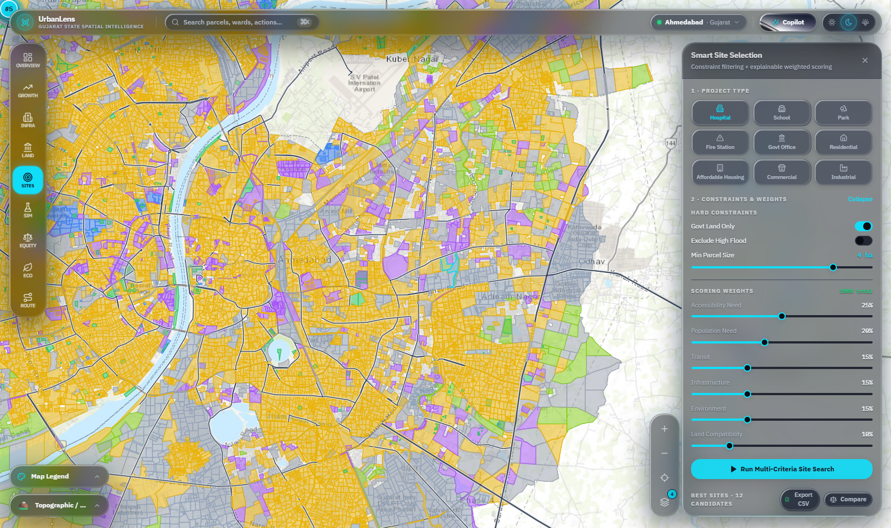
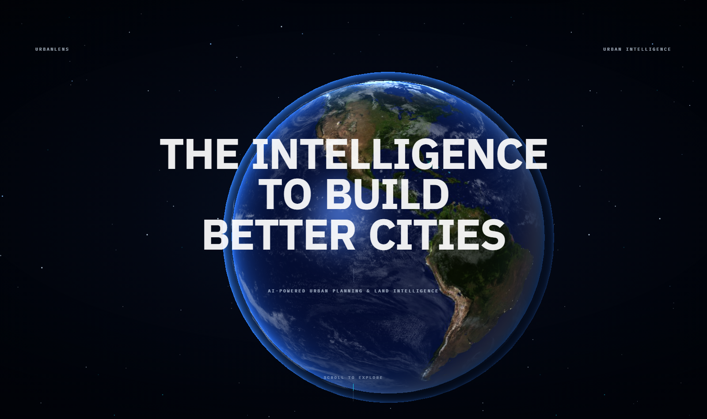

<!-- ================= HEADER ================= -->

<p align="center">
  
</p>

<h1 align="center">🛰️ UrbanLens</h1>

<p align="center">
  <b>AI-Powered Urban Planning &amp; Land Intelligence for Gujarat</b><br>
  <i>34 Districts • 72.3 Million People • Satellite-Grounded • Provenance-First</i>
</p>

<p align="center">
  
  
  
  
  
  
</p>

<p align="center">
  
  
  
  
  
  
  
  
</p>

<p align="center">
  <i>GLIS tells planners <b>what land exists</b>.<br>
  UrbanLens tells them <b>what is happening there, what happens next, and what to build where.</b></i>
</p>

---

# 📑 Table of Contents

| | Section |
|---|---|
| 🎯 | [The Problem](#-the-problem) |
| ✨ | [Key Features](#-key-features) |
| 🚀 | [Getting Started](#-getting-started) |
| 🧭 | [The Nine Modes](#-the-nine-modes) |
| 🧠 | [How the Analytics Work](#-how-the-analytics-work) |
| 🏗️ | [Architecture](#-architecture) |
| 🔌 | [API Reference](#-api-reference) |
| 🗂️ | [Data and Provenance](#-data-and-provenance) |
| 🧰 | [Tech Stack](#-tech-stack) |
| 📊 | [Coverage](#-coverage) |
| ✅ | [Verification](#-verification) |
| ☁️ | [Deployment](#-deployment) |
| ⚠️ | [Known Limitations](#-known-limitations) |
| 👥 | [Team Billota](#-team-billota) |

---

# 🎯 The Problem

**Smart India Hackathon 2026 · Problem Statement PS-SW-001**

Urban local bodies hold land *records* but not land *intelligence*. A planner
can see a parcel's boundary and its owner, and still be unable to answer the
questions that decide a budget:

> Which ward is furthest from a hospital?
> Which green belt is about to be built over?
> Where should a new corridor run?
> And is any of it defensible when challenged in a hearing?

UrbanLens answers these across **all 34 districts of Gujarat** — 72,286,928
people — grounded in real municipal boundaries, OpenStreetMap infrastructure,
Census 2011 totals, and four independent satellite/elevation sources.

### Coverage of the five mandated themes

| | Theme | What UrbanLens delivers |
|---|---|---|
| 🏙️ | **Urban Planning** | Growth detection, 2030 development-pressure model, scenario simulator |
| 🏥 | **Infrastructure Development** | Per-ward service-gap analysis, site suitability scoring, least-cost corridor routing |
| 🌿 | **Environmental Conservation** | Conservation priority, encroachment detection, urban heat island, NDVI, flood risk |
| 📜 | **Land Management / Governance** | Parcel intelligence, tenure, zoning conflicts, vacant government land |
| 📈 | **Socio-economic Analysis** | Ward Equity Index with population-weighted Gini and deprivation share |

---

# ✨ Key Features

- 🗺️ **Statewide Coverage** — all 34 Gujarat districts, layers streamed per district at runtime so the bundle stays small.
- 📡 **Satellite-Grounded** — Sentinel-2 NDVI, MODIS land-surface temperature, Esri 10 m land cover, Copernicus DEM. Not decoration: each drives a specific analytic.
- ⚖️ **Ward Equity Index** — population-weighted Gini, relative deprivation floor, P90-anchored priority ranking.
- 🌳 **Conservation Priority** — ecological sensitivity **×** growth pressure, so a place ranks only when it is both valuable *and* threatened.
- 🚧 **Encroachment Detection** — built-up land intruding into real water and green-space polygons, with per-candidate confidence.
- 🛣️ **Corridor Routing** — 8-connected Dijkstra least-cost path over a weighted cost surface.
- 🔍 **Site Selection** — multi-factor suitability scoring with the reasoning surfaced, concerns included.
- 🧪 **Impact Simulator** — before/after coverage and travel-distance deltas for a proposed facility.
- 🤖 **AI Copilot** — natural-language questions answered from engine tools, never from prose.
- 🧬 **Similar-Parcel Search** — FAISS vector index over parcel feature space.
- 🏷️ **Provenance-First** — every layer is labelled *measured*, *derived*, or *modelled*, and the weakest layer in play is what gets reported.
- 📤 **Export** — PDF reports, CSV and GeoJSON.
- 🎨 **Four Themes** — light, dim, dark, and a 3D globe landing sequence.

---

# 🚀 Getting Started

### Prerequisites

- **Python 3.11+**
- **Node.js 20+**

### Setup

```bash
git clone https://github.com/Destroyerved/UrbanLens.git
```

```bash
cd UrbanLens && npm run setup
```

### Run

```bash
npm run dev
```

That single command starts **both** processes — the Python spatial engine on
`:8000` and the Next app on `:3000` — with output interleaved and prefixed.

> 💡 **Why one command?** If either process dies, the other is stopped
> deliberately. A live UI over a dead engine looks like a frontend bug rather
> than a missing backend, and that is a slow thing to diagnose.

Open **<http://localhost:3000>**, click the globe, and you are in the product.

### Running the halves separately

```bash
npm run engine
```

```bash
npm run web
```

---

# 🧭 The Nine Modes

| | Mode | Answers |
|---|---|---|
| 📊 | **Overview** | What is the state of this district right now |
| 📈 | **Urban Growth** | Where has built-up area expanded, and where is pressure highest |
| 🏥 | **Infrastructure** | Which wards are underserved, and by which service |
| 🏞️ | **Land Intelligence** | Which parcels are opportunities, and what is their land use |
| 📍 | **Site Selection** | Where should this facility go — scored and explained |
| 🧪 | **Simulator** | What changes if I build it — before vs after |
| ⚖️ | **Service Equity** | Who is underserved, by how much, and who to prioritise |
| 🌿 | **Conservation** | Which ecology is under the most development pressure |
| 🛣️ | **Corridor** | Where should a linear route run at least cost |

Plus an **AI Copilot**, a **command palette** (<kbd>Ctrl</kbd>/<kbd>⌘</kbd>+<kbd>K</kbd>)
over parcels, wards and actions, and **PDF / CSV / GeoJSON export**.

<p align="center">
  
  
</p>

---

# 🧠 How the Analytics Work

### ⚖️ Ward Equity Index

Scores seven services per ward, then measures the spread with a
**population-weighted Gini** (Brown's formula, with *people* as the unit rather
than wards — a 350,000-person ward must not count the same as a 20,000-person
one).

The deprivation floor is **relative** — 60% of the population-weighted median —
because a fixed threshold calibrated on Ahmedabad is meaningless in a rural
district. Priority ranks by the gap to the weighted **P90**, not the median, so
the list still discriminates when nobody sits below the floor.

### 🌿 Conservation Priority

```
priority = sensitivity × pressure
```

A **product, not a sum** — so a place scores high only when it is *both*
ecologically valuable and genuinely threatened. Sensitivity combines green
space (0.40), water (0.25), NDVI (0.20) and flood exposure (0.15); pressure
comes from the growth model.

### 🚧 Encroachment Detection

Finds built-up land intruding into real OSM water and green-space polygons,
plus NDVI decline inside green polygons.

> ⚠️ **Deliberately not built on ownership.** Only 27 of 9,168 parcels carry
> real tenure, so an ownership-based accusation would be an accusation grounded
> in modelled data. Candidates on gap-filled parcels are excluded outright, and
> every candidate carries a `likely` or `review` confidence.

### 🛣️ Corridor Routing

An 8-connected **Dijkstra least-cost path** over a cost surface:

| Feature | Weight |
|---|---|
| 💧 Water | 12.0 |
| 🌳 Green space | 4.0 |
| 🌊 Flood zone | 3.0 |
| 👥 Population | 2.5 |
| 🛣️ Existing road | ×0.7 discount |

The ordering is deliberate: **bridging a reservoir is real engineering;
routing around a settlement is land acquisition** — and the first is far dearer.

---

# 🏗️ Architecture

Two processes. The Python engine **computes**; the Next app **renders**.

```
                    ┌──────────────────────────┐
   Browser ────────▶│  Next 14  ·  :3000       │
                    │  MapLibre · Zustand · R3F│
                    └────────────┬─────────────┘
                                 │  /api/*
                                 ▼
                    ┌──────────────────────────┐
                    │  FastAPI Engine  ·  :8000│
                    │  47 endpoints            │
                    └────────────┬─────────────┘
                                 │
        ┌────────────┬───────────┼───────────┬────────────┐
        ▼            ▼           ▼           ▼            ▼
    shapely      rasterio    XGBoost      FAISS      reportlab
    pyproj        scipy      sklearn      vector       PDF
```

> 🔑 **The UI holds no analysis of its own.** Every figure on screen originates
> in the engine, so there is one implementation of each idea rather than two
> that drift apart.

### Repository layout

```text
backend/                 🐍 FastAPI spatial engine — 47 endpoints
  app/api/routes.py         The HTTP surface
  app/gis/                  analysis · parcels · conservation · corridor · copilot
  app/ml/                   XGBoost development-pressure model
  app/data/                 Layer loading, SQLite/filesystem sources
  app/vector/               FAISS index for similar-parcel search
  models/                   Trained models, committed so ML is real on clone

web/                     ⚛️ Next 14 · React 18 · MapLibre GL · Zustand
  app/                      Landing sequence + AppShell
  components/panels/        One panel per mode
  components/map/           MapCanvas, layers, legend, basemap
  components/urbanlens-globe/  Three.js landing globe
  lib/api.ts                The single engine client
  data/engine/              Source layers the engine reads (547 MB)
  services/                 Thin facades the UI calls

datasets/                🛰️ DEM, GHSL, Esri land-cover tiles
scripts/                 🔧 Python pipeline + verify-analytics.py
deploy/                  ☁️ Cloud Run + container images
docs/                    📚 Deployment guides + screenshots
```

Layers are fetched **per district at runtime** and swapped in — which is what
makes 34 districts possible. Baking them into the bundle would be hundreds of
megabytes of JavaScript.

---

# 🔌 API Reference

47 endpoints. Interactive docs at **`/docs`** when the engine is running.

<details>
<summary><b>📊 Core & Analytics</b></summary>

| Method | Route | Returns |
|---|---|---|
| `GET` | `/api/health` | Liveness + active data source |
| `GET` | `/api/bootstrap` | Wards, population grid, facilities, roads — one payload |
| `GET` | `/api/overview` | District summary figures |
| `GET` | `/api/equity` | Ward equity index, population-weighted Gini |
| `GET` | `/api/conservation` | Ecological sensitivity × growth pressure |
| `GET` | `/api/encroachment` | Built-up intrusion into water and green space |
| `POST` | `/api/corridor` | Least-cost infrastructure corridor |
| `GET` | `/api/provenance` | Per-layer measured / derived / modelled |

</details>

<details>
<summary><b>🏥 Infrastructure & Sites</b></summary>

| Method | Route | Returns |
|---|---|---|
| `GET` | `/api/infrastructure/gaps` | Per-ward service scores + confidence |
| `GET` | `/api/accessibility` | 15-minute-city reach from a point |
| `POST` | `/api/suitability/search` | Ranked candidate sites |
| `POST` | `/api/suitability/calculate` | Score a specific location |
| `POST` | `/api/scenarios/simulate` | Before/after impact of an intervention |

</details>

<details>
<summary><b>🌍 Environment & Growth</b></summary>

| Method | Route | Returns |
|---|---|---|
| `GET` | `/api/growth` | Built-up area by year, urbanising parcels |
| `GET` | `/api/growth/prediction` | 2030 development-pressure grid |
| `GET` | `/api/thermal/status` · `/raster` | Urban heat island (MODIS LST) |
| `GET` | `/api/vegetation` | Sentinel-2 NDVI |
| `GET` | `/api/flood` | DEM-derived flood risk |
| `GET` | `/api/greenspace` · `/water` | OSM environmental polygons |

</details>

<details>
<summary><b>🏞️ Land, Search & Export</b></summary>

| Method | Route | Returns |
|---|---|---|
| `GET` | `/api/parcels` · `/{id}` | Parcel layer and detail |
| `GET` | `/api/parcels/{id}/similar` | FAISS nearest neighbours |
| `GET` | `/api/zoning/conflicts` | Land-use vs zoning mismatches |
| `POST` | `/api/copilot/query` | Natural-language question |
| `POST` | `/api/report` | PDF report |
| `GET` | `/api/export/parcels` · `/equity` · `/infrastructure` | CSV |

</details>

---

# 🗂️ Data and Provenance

Layers are **not uniformly real**, so each carries its own provenance — served
on `/api/provenance` and shown in the UI. **The weakest layer in play is what
gets reported.**

| Layer | Source | Standing |
|---|---|---|
| 🏛️ Ward boundaries | Digitised municipal ward maps | 🟢 **Official** |
| 🏞️ Parcels, land use | OpenStreetMap land polygons | 🟢 **Measured** |
| 🏥 Facilities, roads | OpenStreetMap via Overpass | 🟢 **Measured** |
| 💧 Water, green space | OpenStreetMap | 🟢 **Measured** |
| 🌱 Vegetation (NDVI) | Copernicus Sentinel-2 L2A | 🟢 **Measured** |
| 🏗️ Land cover / built-up | Esri 10 m annual land cover | 🟢 **Measured** |
| 🌡️ Heat island (LST) | NASA GIBS MODIS Terra | 🟢 **Measured** |
| 🌊 Flood risk | Copernicus DEM 30 m + water layer | 🟡 **Derived** |
| 👥 Population | Census 2011 × area × road density | 🟡 **Derived** |
| 📜 Ownership / tenure | Mostly modelled; OSM confirms a minority | 🟡 **Derived** |
| 🗺️ Official zoning | DP sheets not published machine-readably | 🔴 **Modelled** |
| 🔮 Growth prediction | XGBoost on real OSM land-use labels | 🔴 **Modelled** |

> ### 🚫 Two things this project deliberately does not do
> **Present modelled data as official**, and **report a score without its
> confidence.** Where OpenStreetMap under-maps a facility type — 121 schools
> mapped against roughly 1,944 expected for Ahmedabad's 7.2 M — the affected
> scores are labelled *thin data* with the counts behind the caveat, rather
> than shipped as findings.

---

# 🧰 Tech Stack

### 🐍 Engine

<p>
  
  
  
  
</p>

### 🌍 Geospatial

<p>
  
  
  
  
</p>

### 🧠 Machine Learning & Search

<p>
  
  
  
  
  
  
</p>

### ⚛️ Application

<p>
  
  
  
  
  
  
</p>

### 🗺️ Mapping & 3D

<p>
  
  
  
</p>

### 🛰️ Data Sources

<p>
  
  
  
  
  
  
</p>

> 🔧 **No PostGIS, no GDAL.** Layers are GeoJSON and the spatial work is
> shapely + pyproj + numpy, which keeps the install working on any machine
> without a system geospatial stack. Every `ST_*` operation the brief lists has
> a direct equivalent in what is used.

---

# 📊 Coverage

<p align="center">
  
  
  
</p>

**Ahmedabad** is the reference district — digitised municipal wards, densest OSM
coverage:

| Metric | Value |
|---|---|
| 🏛️ Wards | 48 |
| 📐 Area | 441 km² |
| 👥 Population (2026 est.) | 7,200,002 |
| 🏞️ Parcels tracked | 17,215 |
| 🏛️ Government parcels | 2,415 |
| 🟩 Vacant government land | 415 ha |
| 🏗️ Built-up 2018 → 2024 | 307 → 349 km² **(+13.7%)** |

Largest district by workload: **Kutch** — 131,125 parcels over a 620,000-cell
population grid.

---

# ✅ Verification

Four harnesses. All passing on `main`.

```bash
npm run demo
```

```bash
npm run verify:ui -- http://localhost:3000 "C:/Program Files/Google/Chrome/Application/chrome.exe"
```

```bash
python -m pytest backend -q
```

```bash
python scripts/verify-analytics.py
```

| Harness | Covers | Result |
|---|---|---|
| 🎬 `npm run demo` | The planning story end-to-end through the engine | ✅ 12/12 steps |
| 🖥️ `npm run verify:ui` | Drives the real UI headlessly; fails on any console error | ✅ 32 checks |
| 🧪 `pytest` | Engine unit + API smoke | ✅ 9 passed |
| 🌐 `verify-analytics.py` | 5 analytics × **all 34 districts** | ✅ exit 0 |

The analytics verifier exits non-zero on any failure, so it can **gate a
release**. It exists because an analytic can pass in Ahmedabad and still divide
by zero in Dang (two wards) or time out in Kutch (131k parcels).

---

# ☁️ Deployment

Frontend on **Vercel**, engine on a host with real memory. Sizing is
**measured, not guessed** — peak RSS on a cold process building parcels from
street geometry:

| District | Peak RSS | Parcels |
|---|---|---|
| Ahmedabad | 556 MB | 17,215 |
| **Kutch** | **2,956 MB** | **131,125** |

> ⚠️ That rules out every 512 MB free tier. Kutch's figure is a *single-request*
> peak, so it cannot be reduced by serving fewer districts.

| Guide | Target |
|---|---|
| ☁️ **[docs/CLOUD_RUN.md](docs/CLOUD_RUN.md)** | Google Cloud Run at 4 GiB — `bash deploy/cloudrun/deploy.sh` |
| 💻 **[docs/DEMO_HOSTING.md](docs/DEMO_HOSTING.md)** | Serve the engine from your own machine through a TLS tunnel |
| 🤗 **[docs/HF_SPACES.md](docs/HF_SPACES.md)** | Hugging Face Docker Space *(now requires PRO)* |

> 💡 The browser calls the engine **directly**, not through Next's rewrite. A
> cold engine takes up to a minute to answer, and an edge proxy returns a
> gateway timeout well before it does — which surfaces in the console as a CORS
> error and sends you hunting in entirely the wrong place.

---

# ⚠️ Known Limitations

*Stated plainly, because a planning tool that hides its own uncertainty is
worse than one that has none.*

| | Limitation |
|---|---|
| ⚖️ | **Equity banding is calibrated for municipal wards.** In rural districts the "wards" are talukas of 150k–300k people scored against thresholds tuned for Ahmedabad's 48 municipal wards, so most read as "poor". The arithmetic is correct; the banding is not yet district-class aware. |
| 🛣️ | **Corridor detours are large where terrain is genuinely expensive.** Narmada routes 194.7% longer than straight — but that straight line crosses 37 of 80 sampled cells of protected green space plus water and flood zone, at **5.1× the mean cost** of the chosen route. That is the conservation weighting working, not a routing fault. |
| 📜 | **Ownership is mostly modelled.** 27 of 9,168 parcels carry real tenure. No feature accuses anyone on that basis. |
| 🗺️ | **Zoning is modelled.** DP sheets are not published machine-readably, so conflict counts indicate where to *look*, not what to enforce. |
| 🔮 | **The growth model is a pressure classifier, not a dated forecast.** 0.955–0.962 ROC AUC on real OSM labels, but "will this urbanise by 2030" needs observed built-up extent at two dates at finer resolution than this repo holds. |
| 🤖 | **The copilot uses Ollama when running, a deterministic intent router when not.** Either way the engine produces every number, so answers are identical in substance and only fixed in wording without it. |
| 🌐 | **`?city=gujarat`** (statewide composite) is not a supported study area — no water layer, some analytics fail. The UI filters it out of the selector. |

---

# 👥 Team Billota

<p align="center">
  
  
  
</p>

<table align="center">
  <tr>
    <td align="center" width="220">
      <a href="https://github.com/Destroyerved">
        <br>
        <b>Ved Sharma</b>
      </a><br>
      <sub>👑 <b>Team Lead</b></sub><br>
      <sub>Spatial Engine &amp; Analytics</sub><br>
      <a href="https://github.com/Destroyerved"></a>
    </td>
    <td align="center" width="220">
      <a href="https://github.com/harshil7patel">
        <br>
        <b>Harshil Patel</b>
      </a><br>
      <sub>🎨 <b>Frontend Lead</b></sub><br>
      <sub>3D Globe &amp; Map Interface</sub><br>
      <a href="https://github.com/harshil7patel"></a>
    </td>
    <td align="center" width="220">
      <a href="https://github.com/rudra129r-lgtm">
        <br>
        <b>Rudra Darji</b>
      </a><br>
      <sub>🗄️ <b>Data Engineer</b></sub><br>
      <sub>Pipeline &amp; Backend Layers</sub><br>
      <a href="https://github.com/rudra129r-lgtm"></a>
    </td>
  </tr>
  <tr>
    <td align="center" width="220">
      <a href="https://github.com/anushkayerpude">
        <br>
        <b>Anushka Yerpude</b>
      </a><br>
      <sub>⚛️ <b>Frontend Developer</b></sub><br>
      <sub>Panels &amp; Dataset Assets</sub><br>
      <a href="https://github.com/anushkayerpude"></a>
    </td>
    <td align="center" width="220">
      <a href="https://github.com/Krrish2928">
        <br>
        <b>Krish Sharma</b>
      </a><br>
      <sub>🌐 <b>Frontend Developer</b></sub><br>
      <sub>Landing Experience &amp; Theming</sub><br>
      <a href="https://github.com/Krrish2928"></a>
    </td>
    <td align="center" width="220">
      <a href="https://github.com/dhruvya0112">
        <br>
        <b>Dhruvya Makadia</b>
      </a><br>
      <sub>📚 <b>Documentation</b></sub><br>
      <sub>Docs &amp; Presentation</sub><br>
      <a href="https://github.com/dhruvya0112"></a>
    </td>
  </tr>
</table>

### 📋 Contributions

| | Member | Role | What they built |
|---|---|---|---|
| 👑 | **[Ved Sharma](https://github.com/Destroyerved)** | **Team Lead** · Spatial Engine &amp; Analytics | Architected the two-process system. Built the FastAPI engine, the equity / conservation / encroachment / corridor analytics, the ML pressure model, FAISS parcel search, the provenance layer, deployment pipeline and the verification harnesses. |
| 🎨 | **[Harshil Patel](https://github.com/harshil7patel)** | **Frontend Lead** · 3D Globe &amp; Map Interface | Led the frontend. Built the Three.js landing globe — geometry, shaders, texture pipeline and the procedural fallback Earth — plus the MapLibre map components, shared UI primitives and the screenshot harness output. |
| 🗄️ | **[Rudra Darji](https://github.com/rudra129r-lgtm)** | Data Engineer · Pipeline &amp; Backend Layers | Built the ingestion pipeline — AMC GIS scraping, Census 2011 processing, Overpass/OSM fetching — and the engine's data layers. Largest contributor to `backend/app` and to the 547 MB of source layers in `web/data/engine`. |
| ⚛️ | **[Anushka Yerpude](https://github.com/anushkayerpude)** | Frontend Developer · Panels &amp; Data | Mode panels in the dashboard, frontend data assets, processed population grids and map-data wiring. |
| 🌐 | **[Krish Sharma](https://github.com/Krrish2928)** | Frontend Developer · Landing &amp; Theming | The landing sequence and orbital hero section, the globe camera rig, app-shell integration and global theme styling across light, dim and dark. |
| 📚 | **[Dhruvya Makadia](https://github.com/dhruvya0112)** | Documentation | Project documentation and repository presentation. |

---

<p align="center">
  
</p>

<p align="center">
  <sub><b>UrbanLens</b> · Team Billota · Smart India Hackathon 2026 · PS-SW-001</sub><br>
  <sub><i>Built on real boundaries, real satellites, and honest provenance.</i></sub>
</p>
